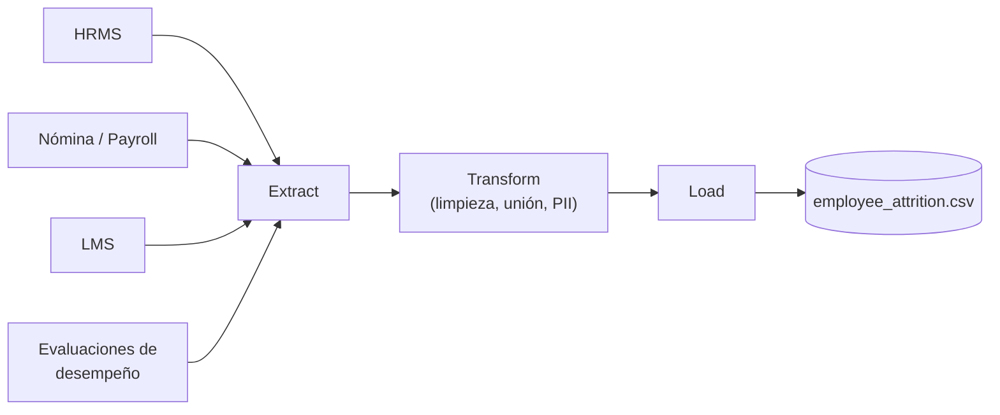
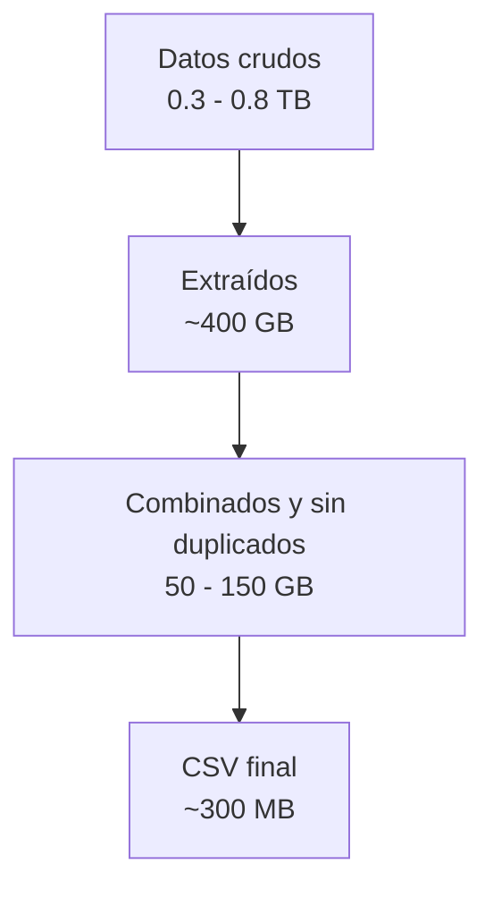

# Fundamento 1: Construyendo el Pipeline del Dataset

## Objetivo de este módulo

Entender **de dónde sale el dataset** que usaremos en todo el curso, antes de tocar una sola línea de código de Machine Learning. La idea no es que te conviertas en ingeniero de datos, sino que entiendas el panorama completo: cómo varios sistemas empresariales terminan convirtiéndose en un único CSV limpio y listo para entrenar un modelo.

### Explícalo en 60 segundos

> "Los datos de un empleado no están en un solo sitio: están en el sistema de RRHH, en nómina, en la plataforma de formación y en las evaluaciones de desempeño, cada uno con su propio formato. Antes de que exista cualquier modelo, alguien tiene que extraer todo eso, quitarle los datos personales, unirlo en una sola fila por empleado y dejarlo en un CSV. A ese proceso se le llama ETL, y normalmente lo automatiza Airflow. Nosotros arrancamos el curso con ese CSV ya hecho, pero es importante saber que existe: sin ese paso, no hay Machine Learning."

## El caso de uso del curso

**Predicción de rotación de empleados (Employee Attrition)** para una organización grande (~500,000 empleados).

- Problema: identificar empleados con alto riesgo de renunciar, antes de que lo hagan.
- Como ya conocemos el resultado histórico (quién se quedó, quién se fue), es un problema de **aprendizaje supervisado**: el modelo aprende patrones de datos históricos para predecir el riesgo de empleados actuales.

## ¿De dónde viene la información?

En un caso real, los datos de un empleado no viven en un solo lugar. Se combinan desde varios sistemas:

| Sistema | Qué contiene | Ejemplos |
|---|---|---|
| HRMS (Sistema de RRHH) | Registros del ciclo de vida del empleado | Fecha de ingreso, rol, área, promociones |
| Nómina / Payroll | Datos de compensación | Salario, bonos, incrementos |
| LMS (plataformas de aprendizaje) | Capacitación | Horas de formación, certificaciones |
| Evaluaciones de desempeño | Feedback y calificaciones | Ratings, cumplimiento de metas |

Cada sistema guarda la información en un formato distinto (bases SQL, XML, JSON, CSV). El primer gran reto de cualquier proyecto de ML es **unificar todo esto en un único dataset limpio**.

## Privacidad y cumplimiento (PII)

Antes de usar cualquier dato para entrenar un modelo, hay que asegurarse de que no viole la privacidad de las personas:

- **Eliminar información personal identificable (PII):** nombres, correos, teléfonos se reemplazan por IDs anonimizados.
- **Enmascarar campos sensibles:** salarios o datos de salud se agregan o enmascaran.
- **Cumplir regulaciones** como GDPR (Europa) o leyes locales de protección de datos.

Esto normalmente es responsabilidad compartida entre el equipo de datos y el equipo de seguridad/cumplimiento.

## El pipeline ETL (Extract, Transform, Load)

Así se llama al proceso que convierte datos crudos y dispersos en un dataset único:

1. **Extract (Extraer):** se conecta a cada sistema (HRMS, nómina, LMS, etc.) y saca los datos crudos.
2. **Transform (Transformar):** se limpia, se combina información de distintas fuentes y se lleva a un formato común.
3. **Load (Cargar):** se guarda el resultado final como un archivo (CSV) o en un almacenamiento como AWS S3, listo para el equipo de Machine Learning.

Este proceso normalmente se automatiza con herramientas de orquestación como **Apache Airflow**, que ejecuta cada paso como una tarea dentro de un flujo de trabajo (parecido a una pipeline de CI/CD, pero para datos).

## De ~0.8 TB a ~300 MB: por qué los datos "encogen" tanto

| Etapa | Tamaño aproximado | Qué pasa |
|---|---|---|
| Datos crudos (en los sistemas de origen) | 0.3 – 0.8 TB | Datos dispersos en múltiples sistemas |
| Extraídos (volcados intermedios) | ~400 GB | Exportados como XML/JSON/SQL |
| Combinados y sin duplicados | 50 – 150 GB | Se eliminan registros duplicados |
| CSV final (con features) | ~300 MB | Una fila por empleado, solo los datos relevantes |

La reducción tan grande ocurre porque pasamos de datos crudos, duplicados y en múltiples formatos, a un dataset limpio con una sola fila por empleado y solo las columnas que realmente aportan valor al modelo.

## ¿Quién hace qué?

| Rol | Responsabilidad |
|---|---|
| Ingeniería de Datos | Construye el pipeline ETL, conecta los sistemas de origen |
| Ciencia de Datos | Decide qué columnas quedarse y cómo agregarlas |
| Seguridad / Cumplimiento | Garantiza el manejo correcto de datos sensibles |
| MLOps / Infraestructura | Provee los servidores/clúster donde corre todo esto (Airflow, almacenamiento, monitoreo), y es quien automatiza y opera este flujo en producción |

## En este repositorio

Para simplificar el aprendizaje, en este bootcamp **no** partimos de sistemas empresariales reales. Usamos directamente un dataset público (adaptado) disponible en [02-phase-1-local-dev-mlops/datasets/employee_attrition.csv](../02-phase-1-local-dev-mlops/datasets/employee_attrition.csv), de forma que puedas seguir el curso sin depender de infraestructura compleja desde el primer día.

## Ideas clave para recordar

- Los datos vienen de muchos sistemas y en muchos formatos distintos.
- La privacidad (PII) debe manejarse **antes** de cualquier trabajo de ML.
- Los pipelines ETL son la base de cualquier proyecto de Machine Learning.
- El volumen de datos se reduce drásticamente entre el dato crudo y el dataset final.
- Los pipelines de datos deben ser reproducibles y monitoreados, igual que cualquier pipeline de software.

## Cómo explicarlo en clase

**Orden sugerido (≈20 min, sin ejecutar código):**

1. Empieza por el problema de negocio, no por la tecnología: "queremos saber quién va a renunciar antes de que pase".
2. Pregunta al grupo dónde creen que están hoy esos datos en su propia empresa. Casi siempre responden "en varios sitios" — ese es justo el punto.
3. Recorre la tabla de sistemas de origen y muestra el diagrama ETL.
4. Entra en PII: es el momento de mayor atención del grupo, porque conecta con algo que ya les preocupa (GDPR, auditorías).
5. Cierra con la tabla de reducción de 0.8 TB a 300 MB: explica que no se "pierden" datos, se resume una fila por empleado.

**Analogías que funcionan:**

- ETL = una pipeline de CI/CD, pero en vez de compilar código, "compila" datos.
- Anonimizar PII = enmascarar variables secretas en los logs de un pipeline: los necesitas para operar, pero no pueden quedar expuestos.

**Confusiones típicas y cómo atajarlas:**

| El alumno dice… | Respuesta corta |
|---|---|
| "¿Entonces yo tengo que construir el ETL?" | En una empresa lo suele hacer Ingeniería de Datos; tú operas y automatizas ese flujo (Airflow, almacenamiento, permisos, monitoreo). |
| "¿Por qué no entrenamos con todos los datos crudos?" | Porque están duplicados, en formatos distintos y con PII. El modelo necesita una tabla única y limpia. |
| "El dataset del curso es muy pequeño" | A propósito: cambia el volumen, no el proceso. Las etapas son idénticas con 300 MB o con 300 GB. |

**Pregunta para lanzar al grupo:** "Si mañana el equipo de nómina cambia el formato de su export, ¿en qué parte del pipeline se rompe todo y quién debería enterarse primero?"

## Preguntas de repaso

1. ¿Por qué no se puede entrenar un modelo directamente con los datos crudos de HRMS, nómina y LMS?

Porque cada sistema guarda la información en un formato distinto (SQL, XML, JSON, CSV) y puede contener datos personales (PII). Hay que unificarlos en un único dataset limpio mediante un pipeline ETL antes de poder usarlos para entrenar.

2. ¿Qué significan las siglas ETL y qué hace cada etapa?

Extract (sacar los datos crudos de cada sistema), Transform (limpiar, combinar y unificar el formato) y Load (guardar el resultado final, por ejemplo como CSV en S3).

3. ¿Por qué el dataset final (~300 MB) es tan pequeño comparado con los datos crudos (~0.8 TB)?

Porque se eliminan duplicados, se combinan registros de múltiples sistemas en una sola fila por empleado, y solo se conservan las columnas realmente relevantes para el modelo.

## Siguiente paso

Continúa con [Fundamento 2: Preparación de Datos](02-preparacion-de-datos.md), donde tomamos el CSV final y lo transformamos paso a paso hasta dejarlo listo para entrenar un modelo.
