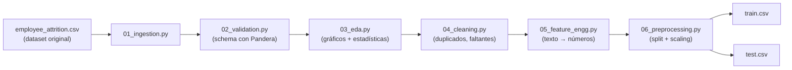

# Fundamento 2: Preparación de Datos (Hands-On)


## Objetivo de este módulo

En el fundamento anterior terminamos con un CSV limpio, pero **ese CSV todavía no está listo para entrenar un modelo**. Este módulo recorre, paso a paso y de forma práctica, el pipeline de preparación de datos que transforma el dataset crudo en archivos de entrenamiento y prueba (`train.csv` / `test.csv`).

> No necesitas entender la ciencia de datos detrás de cada script para completar este módulo. El objetivo es que sepas **qué hace cada etapa y por qué existe**, no que escribas el código desde cero.

### Explícalo en 60 segundos

> "Tenemos un CSV, pero un modelo no puede leerlo tal cual: tiene texto, huecos, duplicados y columnas en escalas muy distintas. Así que pasamos el dataset por seis etapas: lo cargamos (ingestión), comprobamos que cada columna tiene el tipo y los valores esperados (validación), lo miramos con gráficos para entenderlo (EDA), quitamos duplicados y rellenamos faltantes (limpieza), convertimos el texto en números (feature engineering) y por último lo partimos en train y test y ajustamos las escalas (preprocesamiento). Cada script lee lo que produjo el anterior y escribe su propio archivo; el CSV original nunca se toca. El resultado son dos archivos: `train.csv` y `test.csv`."

### Las 6 etapas en una tabla

| # | Script | Pregunta que responde | Produce |
|---|---|---|---|
| 1 | `01_ingestion.py` | ¿Puedo leer el dataset y tiene la pinta esperada? | `raw_ingested.csv` |
| 2 | `02_validation.py` | ¿Los datos cumplen el contrato (tipos y rangos)? | Error temprano o luz verde |
| 3 | `03_eda.py` | ¿Cómo se comportan los datos? ¿Qué columnas importan? | Gráficos y estadísticas |
| 4 | `04_cleaning.py` | ¿Hay duplicados o valores faltantes? | Dataset limpio |
| 5 | `05_feature_engg.py` | ¿Cómo convierto el texto en números? | Dataset numérico con features |
| 6 | `06_preprocessing.py` | ¿Cómo separo y escalo para entrenar? | `train.csv` + `test.csv` |

## ¿Quién hace qué en un equipo real?

| Equipo | Qué hace | Dónde te involucras tú |
|---|---|---|
| Ciencia de Datos | Escribe la lógica de cada etapa (limpieza, features, etc.) | Tú ejecutas y automatizas su código, no lo escribes |
| Ingeniería de Datos | Garantiza que el CSV de entrada llegue en el formato esperado | Gestionas el almacenamiento y accesos que ellos necesitan |
| MLOps / Infraestructura | Provisiona el entorno, automatiza y orquesta el pipeline | Este es tu rol principal |

En producción, cada uno de estos scripts se convierte en una tarea de Airflow, un paso de un pipeline de Kubeflow, o un paso de un workflow de CI/CD (esto lo veremos en la Fase 2 del curso).

## Preparar el entorno local

**Linux / Mac:**

```bash
git clone <url-de-este-repositorio>
cd bootcampmlops/02-phase-1-local-dev-mlops

python3 -m venv venv
source venv/bin/activate
pip install -r requirements.txt
```

**Windows (PowerShell):**

```powershell
git clone <url-de-este-repositorio>
cd bootcampmlops\02-phase-1-local-dev-mlops

python -m venv venv
.\venv\Scripts\Activate.ps1
pip install -r requirements.txt
```

> Guía completa de instalación y ejecución (Windows y Linux/Mac) en [02-phase-1-local-dev-mlops/README.md](../02-phase-1-local-dev-mlops/README.md).

## `paths.py`: la única fuente de verdad para las rutas

Antes de ejecutar cualquier script, vale la pena entender `src/config/paths.py`. Cada script de este pipeline necesita saber dos cosas: **de dónde leer su entrada** y **dónde escribir su salida**. En lugar de escribir esas rutas manualmente en cada archivo, todas se definen en un solo lugar (`paths.py`) y cada script las importa desde ahí.

Patrón importante: cada script lee la salida de la etapa anterior y escribe su propia salida. El archivo original nunca se modifica directamente.

## Las 6 etapas del pipeline



### 1. Ingesta de datos (`01_ingestion.py`)
Carga el CSV en memoria (como una hoja de cálculo dentro de la RAM, usando un `DataFrame` de pandas), imprime una vista previa (primeras filas, dimensiones, tipos de datos) para confirmar que se cargó correctamente, y escribe una copia idéntica en `datasets/processed/raw_ingested.csv`. A partir de aquí, ninguna etapa vuelve a tocar el CSV original.

### 2. Validación de datos (`02_validation.py`)
Los datos reales casi nunca son perfectos: pueden tener inconsistencias o valores faltantes. Este script usa la librería **Pandera** para definir un *schema*: qué columnas se esperan, qué tipo de dato deben tener y qué valores son válidos (por ejemplo, la columna "Age" debe ser un entero mayor a 18; "Attrition" solo puede ser "Stayed" o "Left"). Si algo no cumple el schema, el script lanza un error detallado en lugar de dejar pasar datos corruptos.

**Ejercicio sugerido:** abre `raw_ingested.csv`, cambia algunos valores de "Age" por vacíos, y vuelve a correr la validación. Deberías ver el mensaje de error de Pandera.

### 3. Análisis Exploratorio de Datos — EDA (`03_eda.py`)
Aquí es donde normalmente el Data Scientist "conoce" los datos antes de decidir nada. El script genera gráficos (distribución de edad, conteo de rotación, mapa de calor de correlaciones) usando `matplotlib`/`seaborn`, e imprime estadísticas resumen. Esta información ayuda a decidir qué features conservar o combinar en el siguiente paso.

### 4. Limpieza de datos (`04_cleaning.py`)
Elimina filas duplicadas e identifica/rellena valores faltantes.

### 5. Ingeniería de características — Feature Engineering (`05_feature_engg.py`)

**¿Qué es una "feature"?** Simplemente una columna del dataset que el modelo usa para predecir (Edad, Nivel de puesto, Balance vida-trabajo, etc.).

Los algoritmos clásicos de ML (como Regresión Logística o XGBoost) **solo entienden números**, no palabras. Por eso esta etapa convierte cada valor de texto en un número: por ejemplo, `"Work-Life Balance": Poor/Fair/Good/Excellent` se convierte en `1/2/3/4`, y `"Attrition": Stayed/Left` se convierte en `0/1`.

También se combinan columnas relacionadas en una sola feature más útil (por ejemplo, combinar varias métricas de satisfacción en un solo indicador).

> Nota: en este curso guardamos las features en un archivo `.csv`. En sistemas de producción reales se suele usar un **Feature Store** (una base de datos especializada para guardar y servir features de ML) — lo veremos en la Fase 2 con la herramienta Feast.

### 6. Preprocesamiento final (`06_preprocessing.py`)

Dos cosas ocurren aquí:

- **División (split):** se separa el dataset en `train.csv` (80%, para enseñarle al modelo) y `test.csv` (20%, para evaluar qué tan bien aprendió con datos que nunca vio).
- **Escalado (scaling):** se ajustan los valores numéricos para que estén en rangos similares, de modo que un número grande (como un salario) no "opaque" a uno pequeño (como la edad). Por ejemplo, si Edad mínima = 18, después de escalar se convierte en 0; si Edad máxima = 65, se convierte en 1.

## Ejecutar el pipeline completo

```bash
cd 02-phase-1-local-dev-mlops
export PYTHONPATH="$PWD/src"

python src/data_preparation/01_ingestion.py
python src/data_preparation/02_validation.py
python src/data_preparation/03_eda.py
python src/data_preparation/04_cleaning.py
python src/data_preparation/05_feature_engg.py
python src/data_preparation/06_preprocessing.py
```

Al terminar, tendrás `train.csv` y `test.csv` en `datasets/processed/`, listos para entrenar el modelo en el siguiente fundamento.

## Ideas clave para recordar

- No necesitas escribir la lógica de ciencia de datos, pero sí entender qué hace cada etapa para poder automatizarla después.
- Cada script lee la salida de la etapa anterior — nunca el dataset original.
- La validación de esquema (Pandera) es la forma de "atrapar" errores de datos temprano, antes de que rompan el modelo.
- El feature engineering convierte texto en números porque los algoritmos clásicos de ML solo trabajan con números.
- El resultado final (`train.csv` / `test.csv`) es exactamente lo que necesitamos para el siguiente módulo: entrenar el modelo.

## Cómo explicarlo en clase

**Orden sugerido (≈45 min, ejecutando en vivo):**

1. Muestra primero el diagrama de las 6 etapas y di que vas a recorrerlo de izquierda a derecha; déjalo visible todo el módulo.
2. Abre `paths.py` antes que cualquier script: explica que las rutas están centralizadas y que cada etapa lee la salida de la anterior.
3. Ejecuta las etapas 1 y 2. **Demo estrella:** rompe a propósito un valor de `Age` en `raw_ingested.csv` y vuelve a correr la validación para que vean fallar a Pandera con un mensaje claro.
4. En el EDA, comenta los gráficos en voz alta: aquí el grupo entiende que "mirar los datos" es una decisión técnica, no relleno.
5. En feature engineering, escribe en la pizarra `Poor/Fair/Good/Excellent → 1/2/3/4`. Es el momento en que "hace clic" por qué todo se vuelve numérico.
6. Cierra mostrando `train.csv` y `test.csv` recién generados y su número de filas (80/20).

**Analogías que funcionan:**

- Validación con Pandera = tests unitarios del dataset: fallan rápido y con mensaje claro.
- Cada script lee la salida del anterior = etapas de un `Dockerfile` multi-stage o de una pipeline de CI: cada una parte del artefacto anterior.
- Escalado = normalizar unidades antes de comparar; si no, el salario (miles) aplasta a la edad (decenas).
- Train/test = estudiar con ejercicios resueltos y examinarse con problemas que no viste.

**Confusiones típicas y cómo atajarlas:**

| El alumno dice… | Respuesta corta |
|---|---|
| "¿El EDA no es opcional?" | Es lo que justifica las decisiones de las etapas 4 y 5. Sin EDA se limpia y se crean features a ciegas. |
| "¿Por qué tantos archivos intermedios?" | Para poder reproducir y depurar: si algo sale mal, sabes exactamente en qué etapa se rompió. |
| "¿Podemos escalar antes de dividir en train/test?" | No conviene: el escalado se ajusta con los datos de entrenamiento; si usa el test, el modelo obtiene información que no debería tener. |
| "¿Esto no lo hace automático alguna herramienta?" | En producción sí: cada script pasa a ser una tarea de Airflow o un paso de Kubeflow. Eso es exactamente la Fase 2. |

**Errores comunes al ejecutarlo en vivo:**

- `ModuleNotFoundError: config` → falta exportar `PYTHONPATH=$PWD/src` desde `02-phase-1-local-dev-mlops/`.
- Ejecutar los scripts con `python -m` no funciona: sus nombres empiezan por dígitos (`01_`, `02_`…) y no son módulos válidos.
- Saltarse una etapa provoca un `FileNotFoundError` en la siguiente: el orden 1 → 6 es obligatorio.

**Pregunta para lanzar al grupo:** "Si mañana llega un CSV con una columna nueva y otra renombrada, ¿qué etapa debería avisarnos, y qué pasaría si no existiera esa etapa?"

## Preguntas de repaso

<details>
<summary>1. ¿Por qué cada script del pipeline lee la salida del anterior, en vez de leer siempre el CSV original?</summary>

Porque cada etapa aplica una transformación distinta (validar, limpiar, generar features...) y necesita partir del resultado ya procesado por la etapa anterior. El archivo original nunca se modifica, así siempre se puede reproducir el pipeline desde cero.
</details>

<details>
<summary>2. ¿Qué hace Pandera en la etapa de validación, y qué pasa si una columna no cumple el esquema?</summary>

Pandera define qué columnas se esperan, qué tipo de dato deben tener y qué valores son válidos. Si algo no cumple, el script lanza un error detallado en vez de dejar pasar datos corruptos silenciosamente.
</details>

<details>
<summary>3. ¿Por qué hay que convertir texto como "Poor/Fair/Good/Excellent" en números durante el feature engineering?</summary>

Porque los algoritmos clásicos de ML (como Regresión Logística) solo entienden números, no palabras — necesitan que cada valor de texto se convierta a una representación numérica.
</details>

<details>
<summary>4. ¿Para qué sirve dividir los datos en train.csv y test.csv?</summary>

Para poder evaluar el modelo con datos que nunca vio durante el entrenamiento (test.csv), y así saber si realmente aprendió patrones generales en vez de solo memorizar los datos de entrenamiento.
</details>

## Siguiente paso

Continúa con [Fundamento 3: Entrenamiento del Modelo](03-entrenamiento-modelo.md).
