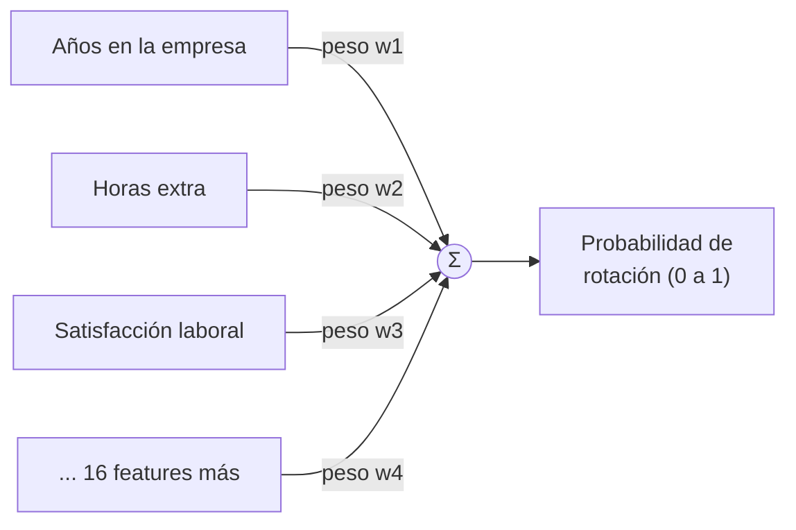
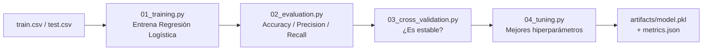

# Fundamento 3: Entrenamiento y Construcción del Modelo

## Objetivo de este módulo

Con `train.csv` y `test.csv` ya listos (fundamento anterior), en este módulo entrenamos, evaluamos y ajustamos el modelo final que predice si un empleado se quedará o se irá.

### Explícalo en 60 segundos

> "Un algoritmo, antes de entrenar, no sabe nada: solo sabe cómo aprender. Entrenar consiste en mostrarle miles de ejemplos históricos de empleados que se quedaron o se fueron para que ajuste sus pesos, es decir, cuánta importancia le da a cada variable. Después lo evaluamos con datos que nunca vio para saber si de verdad aprendió o solo memorizó; con validación cruzada comprobamos que el resultado es estable, y con tuning probamos combinaciones de configuración hasta quedarnos con la mejor. El resultado es un archivo pequeño, `model.pkl`, más un `metrics.json` con las métricas: esos dos archivos son el artefacto que MLOps versiona y despliega."

### Vocabulario que hay que separar bien

| Término | Qué es | Quién lo decide |
|---|---|---|
| Algoritmo | La receta matemática (Regresión Logística, XGBoost…) | Data Scientist |
| Modelo entrenado | El algoritmo con los pesos ya ajustados a nuestros datos | Sale del entrenamiento |
| Parámetros (pesos) | Lo que el modelo aprende solo, a partir de los datos | Nadie: se aprenden |
| Hiperparámetros | La configuración que se fija **antes** de entrenar | Data Scientist / ML Engineer |
| Artefacto | El archivo resultante (`model.pkl`, `metrics.json`) | Lo versiona y despliega MLOps |

## Primero, aclaremos qué es realmente un "modelo"

La palabra "modelo" se usa de dos formas distintas, y ahí nace la confusión:

- **Antes de entrenar**, un "modelo" es solo un algoritmo matemático sin ningún conocimiento. Sabe *cómo* aprender, pero todavía no ha aprendido nada. El mismo algoritmo puede usarse para casos de uso de ML completamente distintos.
- **Después de entrenar**, es el mismo algoritmo, pero ya aprendió valores a partir de nuestro dataset de rotación de empleados.

Cuando decimos que un modelo "aprendió", básicamente significa que ajustó sus configuraciones internas (llamadas **parámetros** o **pesos**) para poder predecir mejor.

## ¿Qué significa "entrenar" en Machine Learning?

Es similar a cómo aprendemos los humanos. Si le enseñas a un niño a reconocer perros, no le das reglas explícitas ("si tiene cuatro patas, cola y ladra, es un perro"). Le muestras muchos ejemplos, y con el tiempo aprende a reconocer perros de todas las formas.

De la misma manera, alimentamos al algoritmo con muchos ejemplos históricos (empleados que se quedaron o se fueron), y el algoritmo encuentra los patrones por sí solo. Ajusta sus **pesos** — piensa en los pesos como "puntajes de importancia" que el modelo asigna a cada variable (años en la empresa, horas extra, satisfacción laboral, etc., no influyen todas por igual). Como ya conocemos el resultado real para empleados pasados, esto se llama **aprendizaje supervisado**.



Cada feature se multiplica por el peso que el modelo aprendió durante el entrenamiento, y la suma de todo eso produce la predicción final.

## ¿Quién elige el algoritmo?

Esa decisión le corresponde al Data Scientist, no a ti. Algoritmos como Regresión Logística (creado por estadísticos en los 1950s) o XGBoost (2016) ya vienen empaquetados en librerías open source como **scikit-learn**. El Data Scientist no escribe el algoritmo desde cero: elige uno de la librería, lo configura y valida que funcione bien con sus datos — de la misma forma en que tú no escribes un balanceador de carga desde cero, sino que configuras Nginx o Envoy.

Para este proyecto se eligió **Regresión Logística**, porque el dataset mezcla números (edad, años en la empresa) y categorías (nivel de puesto, departamento), y este algoritmo maneja bien esa combinación sin trabajo extra.

## Las 4 etapas del entrenamiento



Ejecuta cada script desde `02-phase-1-local-dev-mlops/` con `PYTHONPATH=$PWD/src` configurado (ver [Fundamento 2](02-preparacion-de-datos.md)).

### 1. Entrenamiento (`01_training.py`)

```bash
python src/model_training/01_training.py
```

Carga `train.csv`/`test.csv`, construye un *Pipeline* de scikit-learn (una secuencia de pasos: primero prepara los datos, luego entrena) y entrena un modelo de Regresión Logística. Al terminar, genera el archivo `artifacts/model.pkl`: el modelo entrenado.

**¿Por qué `.pkl`?** Viene de "pickle", el formato de serialización de Python. Guardar el modelo como `.pkl` significa "congelar" todo su estado: todo lo que aprendió, todos sus parámetros internos, incluyendo los pesos que el algoritmo descubrió durante el entrenamiento.

> Dato curioso: nuestro `model.pkl` es un solo archivo pequeño (unos KB) porque solo tiene ~19 pesos aprendidos (uno por cada feature). Un modelo de lenguaje grande (LLM) como Llama-3-8B tiene 8 mil millones de pesos (~16 GB) — el concepto es el mismo, solo cambia la escala. Por eso servir modelos grandes es un desafío de infraestructura tan distinto.

### 2. Evaluación (`02_evaluation.py`)

```bash
python src/model_training/02_evaluation.py
```

Entrenar es la parte fácil. Para saber si el modelo predice bien, lo probamos contra `test.csv` (datos que nunca vio). Las métricas clave:

- **Accuracy (~68%):** qué tan seguido la predicción coincide con el resultado real, en general.
- **Precision (~65%):** cuando el modelo dice "esta persona se irá", ¿qué tan seguido acierta?
- **Recall (~71%):** de todos los empleados que realmente se fueron, ¿a cuántos identificó el modelo correctamente? Como nuestro objetivo es detectar empleados en riesgo a tiempo, **Recall es la métrica más importante** para este caso de uso — un falso negativo (decir que alguien se quedará cuando en realidad se va) es el error más costoso.

### 3. Validación cruzada (`03_cross_validation.py`)

```bash
python src/model_training/03_cross_validation.py
```

El modelo obtuvo un buen puntaje con una sola división de datos. ¿Cómo sabemos que es estable y no está memorizando (**overfitting**)? Este script divide el dataset de 5 formas distintas y entrena/evalúa el modelo en cada división. Si los puntajes son consistentes en las 5, el modelo está aprendiendo patrones reales, no memorizando filas específicas.

### 4. Ajuste de hiperparámetros — Tuning (`04_tuning.py`)

```bash
python src/model_training/04_tuning.py
```

Cada algoritmo tiene configuraciones ajustables antes del entrenamiento, llamadas **hiperparámetros** (los elige el Data Scientist/ML Engineer). Ajustarlos bien evita que el modelo sea demasiado simple (se le escapan patrones) o demasiado rígido (memoriza los datos de entrenamiento). Este script usa `GridSearchCV`, que prueba muchas combinaciones y elige la mejor según Recall.

Como ingeniero de plataforma/infraestructura, no necesitas entender el detalle de estos parámetros para desplegar el modelo. Este paso también genera `artifacts/metrics.json`, con las métricas finales — en un pipeline de CI/CD real, si el Recall cae por debajo de un umbral definido, la pipeline debería fallar y bloquear el despliegue del nuevo modelo.

## Probar el modelo (inferencia)

```bash
python src/model_testing/predict.py
```

El script pide 15 atributos del empleado, deriva automáticamente 4 features adicionales y se los pasa al modelo (19 en total). El resultado es un valor binario:

- `1` = se predice que el empleado se irá
- `0` = se predice que el empleado se quedará

También devuelve un nivel de riesgo (`VERY_LOW` / `LOW` / `MEDIUM` / `HIGH`) según la probabilidad, para saber no solo si alguien se iría, sino qué tan urgente es actuar.

## ¿Y ahora qué?

Ya tenemos un modelo entrenado, evaluado y guardado en `artifacts/model.pkl`. Pero no podemos pedirle a un usuario de negocio (por ejemplo, alguien de RRHH) que ejecute un script de Python por consola. En el siguiente módulo, empaquetamos este modelo dentro de una API REST (FastAPI) y lo servimos con KServe en Kubernetes.

## Ideas clave para recordar

- "Entrenar" = ajustar los pesos internos del modelo a partir de ejemplos históricos.
- Elegir el algoritmo es tarea del Data Scientist; tu trabajo es entender qué artefacto produce y cómo desplegarlo/versionarlo.
- Recall es la métrica más relevante en este caso de uso (detectar a tiempo empleados en riesgo).
- La validación cruzada confirma que el modelo generaliza, no que memorizó los datos.
- El tuning de hiperparámetros optimiza el modelo antes de considerarlo listo para producción.

## Cómo explicarlo en clase

**Orden sugerido (≈40 min, ejecutando en vivo):**

1. Empieza aclarando la doble acepción de "modelo" (antes y después de entrenar). Es la confusión número uno del módulo.
2. Dibuja en la pizarra el esquema de features × pesos → probabilidad. Con eso queda claro qué significa "aprender".
3. Ejecuta `01_training.py` y enseña el `model.pkl` recién creado: señala su tamaño en KB — sorprende siempre.
4. Ejecuta `02_evaluation.py` y **no leas las métricas: discútelas**. Pregunta cuál importa más antes de dar tu opinión.
5. Explica cross-validation como "repetir el examen con cinco exámenes distintos".
6. Cierra con `04_tuning.py` y `metrics.json`, y conecta con CI/CD: si el recall baja de un umbral, la pipeline debe fallar y bloquear el despliegue.

**Analogías que funcionan:**

- Pesos = puntajes de importancia; no todas las variables influyen igual en la decisión.
- Hiperparámetros = los flags de configuración que eliges antes de arrancar un proceso, no algo que el proceso descubre solo.
- `model.pkl` = un artefacto de build (como un `.jar` o una imagen de contenedor): el resultado congelado de un proceso reproducible.
- Overfitting = el alumno que se aprende de memoria el examen del año pasado y suspende el de este año.

**Precision vs. recall en una frase de aula:** *precision* responde "cuando doy la alarma, ¿acierto?"; *recall* responde "de todos los que se fueron, ¿a cuántos vi venir?". En este caso de uso preferimos alguna falsa alarma antes que perder a alguien sin haberlo detectado.

**Confusiones típicas y cómo atajarlas:**

| El alumno dice… | Respuesta corta |
|---|---|
| "68% de accuracy es malo" | Depende del coste de cada tipo de error. Aquí medimos el éxito por recall, no por accuracy. |
| "¿Por qué no probamos el modelo con los mismos datos de entrenamiento?" | Porque saldría un resultado inflado: estaríamos midiendo memoria, no aprendizaje. |
| "¿Tengo que saber elegir hiperparámetros?" | No en el rol MLOps: tú te encargas de que el proceso sea reproducible, versionado y automatizable. |
| "¿Esto vale para un LLM?" | El concepto sí; la escala no: 19 pesos frente a miles de millones cambia por completo la infraestructura de serving. |

**Pregunta para lanzar al grupo:** "Si dentro de seis meses el recall del modelo en producción cae del 71% al 55%, ¿quién debería enterarse, cómo, y qué se hace después?" (es el puente perfecto hacia el módulo de monitoreo de la Fase 2).

## Preguntas de repaso

<details>
<summary>1. ¿Cuál es la diferencia entre un "modelo" antes y después de entrenarlo?</summary>

Antes de entrenar, un modelo es solo un algoritmo matemático sin conocimiento (sabe cómo aprender, pero no ha aprendido nada). Después de entrenar, es el mismo algoritmo pero con sus pesos internos ajustados a partir de los datos históricos.
</details>

<details>
<summary>2. De las métricas accuracy, precision y recall, ¿cuál es la más importante para el caso de rotación de empleados, y por qué?</summary>

Recall, porque el objetivo es detectar a tiempo a los empleados en riesgo de irse — un falso negativo (decir que alguien se quedará cuando en realidad se va) es el error más costoso en este caso de uso.
</details>

<details>
<summary>3. ¿Para qué sirve la validación cruzada (cross-validation)?</summary>

Para confirmar que el modelo es estable y no está memorizando los datos (overfitting): se entrena y evalúa varias veces con divisiones distintas del dataset, y si los puntajes son consistentes, el modelo está aprendiendo patrones reales.
</details>

<details>
<summary>4. ¿Quién decide el algoritmo y los hiperparámetros del modelo: el ingeniero de plataforma o el Data Scientist?</summary>

El Data Scientist. El trabajo del ingeniero de plataforma es entender qué artefacto produce ese modelo (por ejemplo, `model.pkl`) y cómo desplegarlo y versionarlo, no elegir el algoritmo.
</details>

## Siguiente paso

Continúa con [Fundamento 4: De Modelo a API en Vivo con KServe](04-despliegue-kserve.md).
