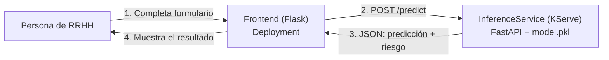
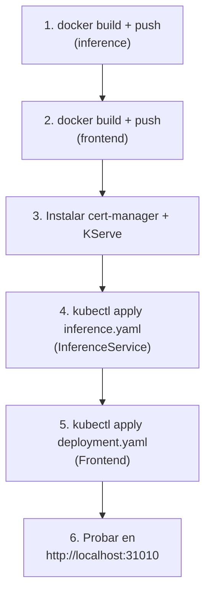

# Fundamento 4: Del Modelo a una API en Vivo con KServe


## Objetivo de este módulo

Tomamos el modelo entrenado en el fundamento anterior (`artifacts/model.pkl`) y lo convertimos en una aplicación real corriendo en Kubernetes, capaz de responder peticiones HTTP.

### Explícalo en 60 segundos

> "Tenemos un `model.pkl`, pero una persona de RRHH no va a abrir una terminal para usarlo. Así que envolvemos el modelo en una API con FastAPI, que expone `/predict` más los endpoints de salud, lo metemos todo en una imagen Docker y lo desplegamos en Kubernetes. En vez de escribir a mano Deployment, Service e Ingress, declaramos un único recurso `InferenceService` y KServe crea el resto, añadiendo autoescalado y gestión de tráfico pensados para modelos. Delante ponemos un frontend Flask con un formulario, que simplemente hace un POST a esa API. Ese es el momento en que el modelo deja de ser un archivo y se convierte en un producto."

## El problema a resolver

`model.pkl` es solo un archivo en disco. Por sí solo, únicamente puede llamarse desde un script de Python (como `predict.py` del fundamento anterior). No hay HTTP, no hay JSON, ninguna otra aplicación puede "hablarle".

En nuestro caso de uso necesitamos darle a RRHH una aplicación con interfaz gráfica para que pueda predecir si un empleado se quedará o se irá. Eso significa que el modelo debe poder llamarse por HTTP desde una aplicación real.

## Arquitectura de este módulo

El setup tiene dos piezas:

1. **La app de Frontend (Flask):** desplegada como un `Deployment` normal de Kubernetes.
2. **El servicio de Inferencia:** desplegado mediante **KServe**.



### La API de Inferencia (FastAPI + model.pkl)

Para hacer que `model.pkl` sea invocable desde la red, lo envolvemos con un servicio que expone un endpoint HTTP, usando **FastAPI**. Esta API tiene 3 endpoints clave:

- `/health` y `/ready`: no son opcionales — KServe los usa para gestionar el ciclo de vida del pod y el enrutamiento de tráfico.
- `/predict`: el endpoint real que hace la predicción.

**Dato clave sobre la carga del modelo:** el modelo se carga en memoria al iniciar el servicio y permanece ahí. Cada solicitud reutiliza el mismo objeto en memoria — no se vuelve a leer `model.pkl` del disco en cada llamada. Este es el mismo patrón usado en sistemas de serving en producción, para mantener baja la latencia.

### La app de Frontend (Flask)

Es solo la capa de interfaz: muestra el formulario HTML, toma la información que ingresa la persona de RRHH, hace un POST al endpoint de inferencia de KServe y muestra el resultado. No contiene ninguna lógica del modelo — solo un formulario y una llamada HTTP. Es exactamente el mismo patrón que cualquier arquitectura de microservicios (como cuando un frontend en Node.js o Go llama a un backend).

## ¿Qué es KServe y por qué no usar simplemente un Deployment?

Ya sabes cómo desplegar un contenedor en Kubernetes con un `Deployment` + `Service` + `Ingress`. Podrías hacerlo así, pero **KServe** ofrece cosas que un `Deployment` básico no tiene: autoescalado, gestión de tráfico y observabilidad, pensadas específicamente para servir modelos de ML.

Piensa en KServe como un "Ingress Controller", pero para modelos de ML. Así como un Ingress de Nginx maneja reglas de enrutamiento HTTP mediante objetos `Ingress`, KServe maneja el servicio de modelos mediante objetos `InferenceService`. Sigue el mismo patrón que otros operadores que ya conoces (Prometheus Operator, Argo CD): instala un CRD (Custom Resource Definition) en el clúster, tú creas un objeto `InferenceService`, y el controlador de KServe se encarga de crear automáticamente los Pods, Services y reglas de enrutamiento.

## Paso a paso



### 1. Empaquetar (Dockerizar) el modelo

El `Dockerfile` está dentro de `02-phase-1-local-dev-mlops/inference/`. Empaqueta `model.pkl` junto con sus dependencias (scikit-learn, numpy, la lógica del predictor). El modelo queda "horneado" (baked) dentro de la imagen en tiempo de build — la imagen versionada (ej. `1.0.0`) es el artefacto del modelo: siempre contiene exactamente el modelo entrenado en el fundamento anterior, sin sorpresas en tiempo de ejecución.

```bash
cd inference
docker build -t <tu-usuario-dockerhub>/attrition-inference:1.0.0 .
docker push <tu-usuario-dockerhub>/attrition-inference:1.0.0
```

> En este repo, el `model.pkl` entrenado debe copiarse primero a `inference/artifacts/model.pkl` antes de este build (ver [02-phase-1-local-dev-mlops/README.md](../02-phase-1-local-dev-mlops/README.md)).

### 2. Empaquetar (Dockerizar) el frontend

```bash
cd frontend
docker build -t <tu-usuario-dockerhub>/attrition-frontend:1.0.0 .
docker push <tu-usuario-dockerhub>/attrition-frontend:1.0.0
```

### 3. Instalar KServe en el clúster

KServe requiere `cert-manager` como prerrequisito.

```bash
# Instalar cert-manager
kubectl apply -f https://github.com/cert-manager/cert-manager/releases/download/v1.19.0/cert-manager.yaml

# Instalar KServe en modo standard
helm install kserve-crd oci://ghcr.io/kserve/charts/kserve-crd --version v0.16.0 -n kserve --create-namespace
helm install kserve oci://ghcr.io/kserve/charts/kserve --version v0.16.0 --set kserve.controller.deploymentMode=Standard -n kserve
```

> Si ves un error de webhook de cert-manager durante la instalación, reinicia el deployment `cert-manager-webhook` para regenerar los certificados, y reinstala KServe.

### 4. Desplegar el `InferenceService`

Un solo YAML (`02-phase-1-local-dev-mlops/k8s/inference.yaml`) es todo lo que necesitas: el CRD `InferenceService` crea automáticamente el Deployment, Service, HPA (autoescalado) y configuración de enrutamiento.

```bash
cd k8s
kubectl apply -f inference.yaml
kubectl get deploy,svc
```

Esto expone el servicio de inferencia internamente (con el sufijo `-predictor` que agrega KServe al nombre del `InferenceService`).

### 5. Desplegar el frontend

```bash
kubectl apply -f deployment.yaml
```

El frontend lee la URL del servicio de inferencia desde una variable de entorno en tiempo de ejecución, y expone un `NodePort` (puerto `31010`) para acceder a la interfaz.

### 6. Probar todo

Abre `http://localhost:31010`, completa el formulario y presiona "Predict Attrition" para ver la predicción en vivo.

## Contexto del mundo real: ¿Y si el modelo pesa 15 GB?

Para nuestro modelo (unos KB), hornear el archivo dentro de la imagen Docker es perfectamente razonable y mantiene todo simple. Pero eso no funciona con modelos grandes: una imagen de 15 GB tarda minutos en descargarse, consume mucha memoria por cada réplica y complica el autoescalado.

En producción, los modelos grandes se guardan aparte, en un *model registry* o almacenamiento de objetos (S3, GCS), y el contenedor descarga solo los pesos que necesita al iniciar — KServe soporta esto de forma nativa. Para modelos todavía más grandes (LLMs), se usa además *sharding* entre varias GPUs y runtimes especializados como vLLM o Triton Inference Server, en lugar de una simple app FastAPI.

## Ideas clave para recordar

- Un modelo entrenado (`.pkl`) no sirve de nada hasta que se empaqueta detrás de una API.
- KServe es a los modelos de ML lo que un Ingress Controller es al tráfico HTTP: un operador especializado sobre Kubernetes.
- `/health` y `/ready` no son opcionales — KServe los necesita para gestionar el ciclo de vida del pod.
- El modelo se carga una sola vez en memoria al iniciar, no en cada request.
- Hornear el modelo dentro de la imagen Docker funciona bien para modelos pequeños; modelos grandes requieren almacenamiento externo y runtimes especializados.

## Cómo explicarlo en clase

**Orden sugerido (≈40 min):**

1. Abre con la tensión del módulo: "ya tenemos el modelo… enséñaselo ahora a la persona de RRHH". Casi nadie propone "mándale el `.pkl`".
2. Muestra el diagrama de las dos piezas (frontend y servicio de inferencia) y sigue el recorrido de una petición: formulario → POST → predicción → pantalla.
3. Explica los endpoints. Insiste en que `/health` y `/ready` no son adorno: son el contrato con Kubernetes.
4. Compara en pizarra las dos columnas: *Deployment + Service + Ingress a mano* frente a *un solo `InferenceService`*.
5. Demo final: formulario en `http://localhost:31010`, cambiar un par de valores y ver cómo cambia el nivel de riesgo. Es el cierre emocional de toda la Fase 1.
6. Termina con el escenario "¿y si el modelo pesa 15 GB?" para abrir el debate hacia registros de modelos y LLMs.

**Analogías que funcionan:**

- KServe = un Ingress Controller, pero para modelos: tú declaras el recurso y el operador crea Pods, Services y enrutamiento.
- El patrón operador + CRD ya lo conocen de Prometheus Operator o Argo CD: aquí el CRD se llama `InferenceService`.
- Cargar el modelo una sola vez al arrancar = un pool de conexiones: se abre al inicio, no en cada request.
- La imagen versionada (`1.0.0`) = el artefacto inmutable del modelo, igual que cualquier release de tu aplicación.

**Confusiones típicas y cómo atajarlas:**

| El alumno dice… | Respuesta corta |
|---|---|
| "¿El frontend hace la predicción?" | No: el frontend solo dibuja el formulario y hace una llamada HTTP. Toda la lógica del modelo vive en la API de inferencia. |
| "¿Podría usar solo un Deployment?" | Sí, y funcionaría; pero perderías autoescalado, gestión de tráfico y observabilidad orientados a modelos, y tendrías que mantener tres YAML en vez de uno. |
| "¿Por qué meter el modelo dentro de la imagen?" | Porque aquí pesa unos KB y garantiza que imagen y modelo viajan juntos. Con modelos grandes se hace al revés: se descarga desde S3 o un registro de modelos al arrancar. |
| "¿El `-predictor` del nombre del servicio es un error?" | No: KServe añade ese sufijo automáticamente al nombre del `InferenceService`. |

**Errores comunes en la demo en vivo:**

- Construir la imagen sin haber copiado antes `model.pkl` a `inference/artifacts/`.
- Fallos del webhook de cert-manager al instalar KServe: reinicia el deployment `cert-manager-webhook` y reinstala.
- El pod arranca pero no recibe tráfico: casi siempre es `/ready` respondiendo mal.

**Pregunta para lanzar al grupo:** "Mañana entrenamos un modelo mejor. ¿Qué pasos hay que repetir para llevarlo a producción, y cuántos de ellos hicimos hoy a mano?" (respuesta: casi todos — y eso es justo lo que automatiza la Fase 2).

## Preguntas de repaso

<details>
<summary>1. ¿Por qué no basta con tener el archivo model.pkl para que RRHH pueda usar el modelo?</summary>

Porque `model.pkl` solo puede invocarse desde un script de Python. Para que otra aplicación (el frontend) pueda usarlo, hay que envolverlo en una API HTTP (FastAPI) que reciba solicitudes y devuelva predicciones.
</details>

<details>
<summary>2. ¿Qué ventaja da KServe frente a crear manualmente un Deployment + Service + Ingress?</summary>

KServe agrupa todo eso en un solo recurso (`InferenceService`) y agrega funcionalidades pensadas específicamente para servir modelos: autoescalado, gestión de tráfico y observabilidad.
</details>

<details>
<summary>3. ¿Por qué los endpoints /health y /ready no son opcionales en la API de inferencia?</summary>

Porque KServe los usa para gestionar el ciclo de vida del pod y decidir cuándo enrutarle tráfico — sin ellos, KServe no sabría si el modelo ya está listo para recibir solicitudes.
</details>

<details>
<summary>4. ¿Por qué "hornear" el modelo dentro de la imagen Docker funciona bien aquí, pero no serviría para un modelo de 15 GB?</summary>

Para nuestro modelo (unos KB) es simple y rápido. Pero una imagen de 15 GB tardaría minutos en descargarse y consumiría mucha memoria por réplica — los modelos grandes se guardan aparte (S3/registro de modelos) y se descargan dinámicamente al iniciar el pod.
</details>

## ¿Qué sigue?

Con esto termina la Fase 1 del bootcamp: ya recorriste el camino completo desde el dataset crudo hasta un modelo sirviendo predicciones en Kubernetes. La Fase 2 introduce las herramientas de nivel empresarial (versionado de datos, feature store, pipelines orquestados, experiment tracking y monitoreo) — ver [04-phase-2-enterprise-setup-mlops/README.md](../04-phase-2-enterprise-setup-mlops/README.md) y el [temario completo del bootcamp](../README.md).
