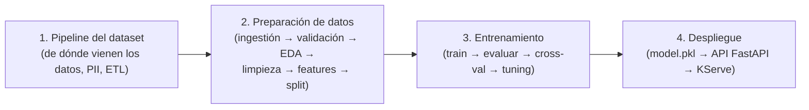

# Fundamentos del Bootcamp MLOps (Fase 1: ML y Data Science)

Esta carpeta contiene el material didáctico en español de la **Fase 1** del bootcamp: el recorrido completo desde "¿de dónde sale el dataset?" hasta "el modelo sirviendo predicciones en Kubernetes". Cada tema tiene dos formatos complementarios:

- **Guía en Markdown** (`.md`): conceptos explicados en español, con diagramas y sin necesidad de ejecutar nada.
- **Notebook** (`.ipynb`): la versión hands-on de la misma guía, con celdas de código que puedes correr y modificar para ver los resultados tú mismo.

> Si es tu primera vez en el curso, empieza por las guías `.md` en orden (1 → 4) y luego repite el recorrido en los notebooks para practicar.
> Si vas a **impartir** esta fase, lee antes la sección [Cómo dar esta clase](#cómo-dar-esta-clase-guion-para-el-instructor).

## La historia completa en 6 frases

Esta es la narrativa que hilvana toda la fase. Si alguien te interrumpe en clase y pregunta "¿y esto para qué?", vuelve a estas 6 frases:

1. Una empresa quiere saber **qué empleados están a punto de renunciar**, para actuar antes de que pase.
2. Los datos de esos empleados están repartidos en muchos sistemas (RRHH, nómina, formación, desempeño), así que un proceso **ETL** los unifica en un solo CSV sin datos personales.
3. Ese CSV todavía no sirve para entrenar: hay que **validarlo, explorarlo, limpiarlo, convertir el texto en números y partirlo** en train/test.
4. Con `train.csv` se **entrena** un modelo, con `test.csv` se **evalúa**, y se ajusta hasta que detecta bien a los empleados en riesgo.
5. El resultado del entrenamiento es un archivo pequeño, `model.pkl`, que por sí solo **no le sirve a nadie del negocio**.
6. Por eso lo envolvemos en una **API (FastAPI)**, lo metemos en una imagen Docker y lo servimos en Kubernetes con **KServe**, con un frontend web delante.

Todo lo que viene después en el bootcamp (Fase 2: Airflow, DVC, MLflow, Feast, monitoreo) consiste en **automatizar, versionar y vigilar** exactamente estos mismos 6 pasos.

## Al terminar esta fase, el alumno debe poder…

| # | Objetivo de aprendizaje | Se practica en |
|---|---|---|
| 1 | Explicar de dónde salen los datos de un proyecto de ML y por qué el PII se trata antes de entrenar | Guía 1 |
| 2 | Nombrar las 6 etapas de preparación de datos y decir qué produce cada una | Guía 2 |
| 3 | Ejecutar el pipeline de datos completo y obtener `train.csv` / `test.csv` | Guía 2 (notebook) |
| 4 | Diferenciar algoritmo, modelo entrenado, parámetros e hiperparámetros | Guía 3 |
| 5 | Interpretar accuracy, precision y recall, y justificar cuál importa en este caso | Guía 3 |
| 6 | Explicar por qué un `.pkl` necesita una API para ser útil, y qué aporta KServe frente a un Deployment normal | Guía 4 |
| 7 | Identificar qué parte del flujo es responsabilidad del Data Scientist y cuál del ingeniero MLOps | Todas |

## Requisitos previos

- Haber completado el [Módulo 0](../README.md#módulo-0--kickoff-y-fundamentos-1-sesión) del bootcamp (conceptos de API, contenedor y Kubernetes).
- Python 3.11+ y nociones básicas del lenguaje — repasa [00-python/](../00-python/) si lo necesitas.
- Lista completa de requisitos técnicos (hardware, software): ver [Requisitos Técnicos](../README.md#requisitos-técnicos) en el README principal.

## Índice

| # | Guía | De qué trata | Markdown | Notebook |
|---|---|---|---|---|
| 1 | Pipeline del Dataset del Proyecto | De dónde salen los datos, privacidad (PII) y el patrón ETL | [01-pipeline-dataset.md](01-pipeline-dataset.md) | [01-pipeline-dataset.ipynb](01-pipeline-dataset.ipynb) |
| 2 | Etapas de Preparación de Datos | Ingestión → validación → EDA → limpieza → features → split | [02-preparacion-de-datos.md](02-preparacion-de-datos.md) | [02-preparacion-de-datos.ipynb](02-preparacion-de-datos.ipynb) |
| 3 | Entrenamiento y Construcción del Modelo | Entrenar, evaluar, validación cruzada y ajuste de hiperparámetros | [03-entrenamiento-modelo.md](03-entrenamiento-modelo.md) | [03-entrenamiento-modelo.ipynb](03-entrenamiento-modelo.ipynb) |
| 4 | Del Modelo a una API en Vivo con KServe | Empaquetar el modelo en una API (FastAPI + Docker) y servirla en Kubernetes | [04-despliegue-kserve.md](04-despliegue-kserve.md) | [04-despliegue-kserve.ipynb](04-despliegue-kserve.ipynb) |

### Qué entra y qué sale de cada guía

Si te pierdes en la clase, esta tabla te reubica: cada fundamento consume un artefacto y produce otro. **Nadie avanza sin el archivo del paso anterior.**

| Guía | Entrada | Salida | La frase que debe quedar |
|---|---|---|---|
| 1. Pipeline del dataset | Sistemas de la empresa (HRMS, nómina, LMS, desempeño) | `employee_attrition.csv` | "Antes del ML hay un trabajo de datos que alguien tuvo que hacer" |
| 2. Preparación de datos | `employee_attrition.csv` | `train.csv` + `test.csv` | "El modelo solo entiende números limpios y validados" |
| 3. Entrenamiento | `train.csv` + `test.csv` | `model.pkl` + `metrics.json` | "Entrenar es ajustar pesos; evaluar es decidir si sirve" |
| 4. Despliegue | `model.pkl` | Imagen Docker + `InferenceService` en el clúster | "Un modelo sin API no le sirve al negocio" |

## Qué aprendes en cada fundamento



## Cómo dar esta clase (guion para el instructor)

Guion sugerido para una sesión de ~3 horas. Los tiempos son orientativos: lo importante es el orden (**primero el porqué, después el código**).

| Momento | Tiempo | Qué haces | Cómo lo abres |
|---|---|---|---|
| Enganche | 10 min | Planteas el problema de negocio, sin tecnología | "Si supieras que 3 de tus mejores ingenieros van a renunciar el mes que viene, ¿qué harías distinto hoy?" |
| Fundamento 1 | 20 min | Guía 1 en pizarra/diagrama, sin ejecutar nada | "Antes de hablar de modelos, ¿alguien sabe dónde están hoy los datos de RRHH de su empresa?" |
| Fundamento 2 | 45 min | Ejecutas el notebook 2 en vivo, etapa por etapa | "Vamos a romper el dataset a propósito para ver quién nos avisa" (demo de Pandera) |
| Descanso | 10 min | — | — |
| Fundamento 3 | 40 min | Notebook 3: entrenar, ver métricas, discutirlas | "El modelo acierta el 68%… ¿eso es bueno o malo? Depende de a quién le falles" |
| Fundamento 4 | 40 min | Guía 4 + demo del frontend llamando a la API | "Ya tenemos el modelo. Enséñaselo ahora a la persona de RRHH: no puede abrir una terminal" |
| Cierre | 15 min | Preguntas de repaso de cada guía + puente a la Fase 2 | "Todo esto lo hicimos a mano. En la Fase 2 lo automatizamos" |

**Consejos de aula:**

- Deja siempre visible el diagrama de las 4 etapas: en cada tema, señala en qué caja estás.
- Usa las preguntas de repaso (`<details>`) al final de cada guía como control de comprensión antes de avanzar.
- Ejecuta el pipeline **antes** de la clase, para tener los archivos generados por si algo falla en vivo.
- Si el grupo viene de infraestructura/DevOps, apóyate en las analogías de la tabla siguiente: casi todo tiene un equivalente que ya conocen.

## Analogías listas para usar en clase

| Concepto | Analogía para explicarlo |
|---|---|
| Pipeline ETL | Una pipeline de CI/CD, pero en vez de compilar código, "compila" datos |
| Validación con Pandera | Los tests unitarios del dataset: fallan rápido y con mensaje claro |
| Feature engineering | Traducir de idioma humano ("Excelente") al único idioma que entiende el modelo (números) |
| Train / test split | Estudiar con los ejercicios resueltos (train) y medirse con el examen que no viste (test) |
| Entrenar un modelo | Enseñarle a un niño a reconocer perros con ejemplos, no con reglas escritas |
| Pesos del modelo | Puntajes de importancia: no todas las variables pesan lo mismo en la decisión |
| Hiperparámetros | Los flags de configuración que eliges **antes** de arrancar el proceso |
| `model.pkl` | Un artefacto de build (como un `.jar` o una imagen): el resultado congelado del entrenamiento |
| KServe | Un Ingress Controller, pero para modelos: tú declaras un `InferenceService` y el operador crea lo demás |

## Preguntas que siempre aparecen (y respuesta corta)

<details>
<summary>"¿Tengo que saber matemáticas o ciencia de datos para esto?"</summary>

No para esta fase. El objetivo del rol MLOps es entender **qué produce cada etapa y qué artefacto hay que mover, versionar y desplegar**, no derivar las fórmulas. Quien elige algoritmo e hiperparámetros es el Data Scientist.
</details>

<details>
<summary>"¿Por qué no entrenamos directamente con el CSV original?"</summary>

Porque tendría texto, duplicados, huecos y posibles errores de tipo. El modelo solo acepta números limpios, y sin validación previa un dato corrupto se convierte en un modelo malo que nadie detecta.
</details>

<details>
<summary>"¿Un accuracy de 68% no es demasiado bajo?"</summary>

Depende del caso de uso. Aquí interesa **recall**: detectar a la mayoría de quienes realmente se van. Un falso negativo (decir "se queda" a alguien que renuncia) cuesta mucho más que una falsa alarma.
</details>

<details>
<summary>"¿Por qué Kubernetes y no simplemente correr el script?"</summary>

Porque una persona de RRHH no abre una terminal. Necesita una web; esa web necesita una API; y esa API necesita escalar, tener health checks y poder actualizarse sin downtime. Eso es exactamente lo que aporta el clúster + KServe.
</details>

<details>
<summary>"¿Esto sirve igual para modelos de lenguaje (LLMs)?"</summary>

El flujo conceptual sí; la escala no. Nuestro modelo tiene ~19 pesos y pesa unos KB; un LLM tiene miles de millones y decenas de GB, así que cambia el almacenamiento (registro de modelos en vez de "hornear" en la imagen) y el runtime (vLLM/Triton en vez de FastAPI). Ver [MLOPS-VS-LLMOPS.md](../MLOPS-VS-LLMOPS.md).
</details>

## Cómo ejecutar los notebooks

Los notebooks reutilizan el dataset y las carpetas de [02-phase-1-local-dev-mlops/](../02-phase-1-local-dev-mlops/) (por ejemplo, leen `../02-phase-1-local-dev-mlops/datasets/employee_attrition.csv`), así que deben abrirse con el repositorio completo clonado y ejecutarse **en orden** (2 depende de los archivos que genera 1, y así sucesivamente).

**Linux / Mac:**

```bash
cd 01-fundamentosml-datascience
python3 -m venv .venv
source .venv/bin/activate
pip install -r requirements.txt
```

**Windows (PowerShell):**

```powershell
cd 01-fundamentosml-datascience
python -m venv .venv
.venv\Scripts\Activate.ps1
pip install -r requirements.txt
```

Luego abre cualquier `.ipynb` en VS Code (o Jupyter) y selecciona este entorno virtual como kernel.

### Si algo falla en clase (troubleshooting rápido)

| Síntoma | Causa habitual | Solución |
|---|---|---|
| `FileNotFoundError` con `employee_attrition.csv` | El notebook se abrió fuera del repositorio, o el kernel arrancó en otra carpeta | Abre VS Code en la raíz del repo clonado y ejecuta los notebooks desde esta carpeta |
| `ModuleNotFoundError` (pandas, sklearn, pandera…) | El kernel seleccionado no es el `.venv` de esta carpeta | Selecciona el kernel correcto arriba a la derecha del notebook y reinstala `requirements.txt` |
| Un notebook falla porque falta `train.csv` | Se saltó un notebook anterior | Los notebooks son secuenciales: ejecuta 1 → 2 → 3 → 4 en orden |
| Los gráficos no aparecen | Celda ejecutada sin reiniciar tras instalar librerías | Reinicia el kernel y usa "Run All" |
| `ImportError` marcado por Pylance pero el código corre | El editor apunta a otro intérprete | Cambia el intérprete de Python al `.venv` de esta carpeta; no toques los imports |

## Vocabulario mínimo de esta fase

Los 10 términos que un alumno debe poder definir al salir de la clase. Definiciones completas en el [Glosario del Bootcamp](../GLOSARIO.md).

| Término | En una línea |
|---|---|
| ETL | Extraer datos de sus sistemas de origen, transformarlos y cargarlos en un destino único |
| PII | Información personal identificable, que se elimina o anonimiza antes de entrenar |
| Feature | Una columna que el modelo usa para predecir |
| Target / etiqueta | La columna que se quiere predecir (aquí: `Attrition`) |
| Train / test | Datos para aprender vs. datos reservados para evaluar |
| Modelo entrenado | El algoritmo ya con sus pesos ajustados a nuestros datos |
| Parámetros (pesos) | Lo que el modelo aprende solo durante el entrenamiento |
| Hiperparámetros | Lo que se configura antes de entrenar (los elige el Data Scientist) |
| Overfitting | El modelo memorizó los datos de entrenamiento y falla con datos nuevos |
| Inferencia | Usar el modelo ya entrenado para predecir sobre un caso nuevo |

## Caso de uso del curso

Todos los fundamentos giran alrededor del mismo problema: **predicción de rotación de empleados (Employee Attrition)**. Es un problema de aprendizaje supervisado (ya conocemos el resultado histórico: quién se quedó y quién se fue), usando el dataset [employee_attrition.csv](../02-phase-1-local-dev-mlops/datasets/employee_attrition.csv).

## Relación con el resto del repositorio

Cada archivo enlaza a la guía original. Para la guía práctica de comandos de este repositorio, ver [02-phase-1-local-dev-mlops/README.md](../02-phase-1-local-dev-mlops/README.md). Para la agenda completa del bootcamp, ver [README.md](../README.md).

¿Un término no te suena? Revisa el [Glosario del Bootcamp](../GLOSARIO.md). Para repasar los conceptos de Python usados en el código, ver [00-python/](../00-python/).
